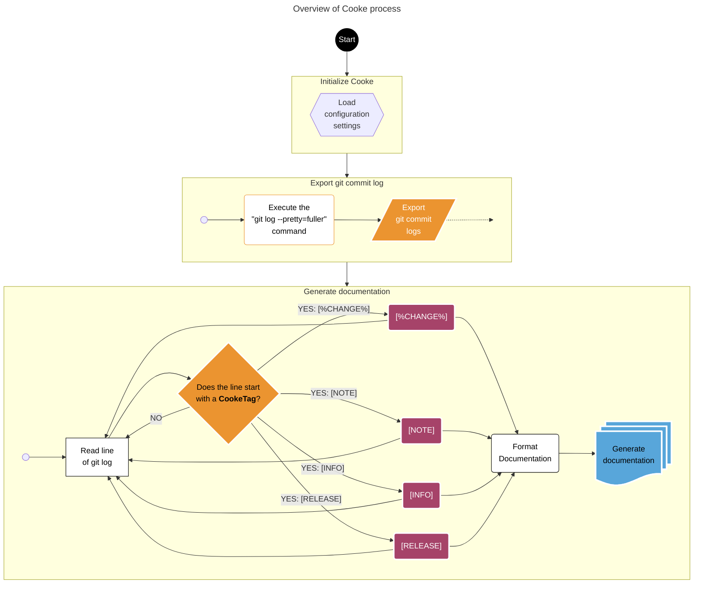

<!-- u250218 -->

> **About Cooke_development**  
> This repository is actually the *development* version of Cooke.  
>
> Since testing requires lots of junk to be written to the `CHANGELOG.md` and `RELEASE-NOTES.md` files, we can keep all of that here and the [*production* version of Cooke](https://github.com/APrettyCoolProgram/Cooke_development) can stay clean.

***

<div align="center">

  

  <h1>
    Generate documentation for git repositories
  </h1>

  &nbsp;&nbsp;&nbsp;&nbsp;[](https://www.apache.org/licenses/LICENSE-2.0)&nbsp;&nbsp;&nbsp;&nbsp;&nbsp;&nbsp;&nbsp;&nbsp;

</div>

# ABOUT COOKE

Cooke is a command-line tool that creates customized documentation for git repositories.

## Features

* Generates a CHANGELOG.md file
* Generates a RELEASE-NOTES.md file
* Highly customizable

## Requirements

* .NET 8 runtime
* Windows operating system

> **Please note**  
While Cooke is written in .NET 8, in theory it should be cross-platform, but currently has only been tested on Windows.

# HOW IT WORKS



***

# THE CookeTag

Cooke parses a repository's git log file and generates documentation when a line starts with a **CookeTag**, which determines what Cooke will do with the line.

By default, a CookeTag starts with the `[` character and ends with the `]` character, but you can specify different characters in the config file.

All CookeTags are entirely optional. If a line does not start with a CookeTag, it is ignored.

## The `[%ChangeType%]` CookTag

The `[%ChangeType%]` CookeTag is probably the most common CookeTag, and indicates the line contains a *change*.

The [%ChangeType%] syntax is:

```
[%ChangeType%] %Short_description_of_the_change%
```

For example:

```
[ADDED] New functionality
```

The `%ChangeType%` can be anything, so you can use whatever terminology you want.

When Cooke generates documentation, it does not modify the `%ChangeType%`, so casing/spacing/etc. will remain as you typed it. You can use anything you want (and spelling mistakes won't be corrected!).

Examples of changes are:
* `ADDED`
* `DEPRECIATED`
* `FIXED`
* `MODIFIED`
* `REMOVED`

Cooke removes the `[` and `]` characters and replaces them with the "`" (backtick) character, so the generated document will look like this:

&nbsp;&nbsp;&nbsp;&nbsp;&nbsp;&nbsp;&nbsp;&nbsp;`ADDED` New functionality

All `[%ChangeType%]` lines are added to the CHANGELOG.md file.

## The `[NOTE]` CookTag

The `[NOTE]` CookeTag provides additional information about a *change* that should be documented in the RELEASE-NOTES.md file. 

The `[NOTE]` CookeTags always directly follows a `[%ChangeType%]` CookeTag.

A `[NOTE]` line looks like this (along with its *change*):

```
[ADDED] New functionality
[NOTE] This new functionality is awesome!
```

Cooke removes `[NOTE]` characters so the generated document will look like this:

&nbsp;&nbsp;&nbsp;&nbsp;&nbsp;&nbsp;&nbsp;&nbsp;`ADDED` New functionality  
&nbsp;&nbsp;&nbsp;&nbsp;&nbsp;&nbsp;&nbsp;&nbsp;This new functionality is awesome!

## The `[RELEASE]` CookTag

The `[RELEASE]` CookeTag indicates a new release that should be documented in both the CHANGELOG.md and RELEASE-NOTES.md files.

Once a `[RELEASE]` CookeTag is found, all of the documentation generated since the *last* `[RELEASE]` CookeTag is included under the new `[RELEASE]` CookeTag.

A timestamp in the format of `YYYY-MM-DD` is appended to the release, as so:

`Release 1.0 (2025-01-01)`

Any documentation that is generated without a `[RELEASE]` CookeTag is listed under "Current Development".

If documentation is generated for a `[RELEASE]` CookeTag, but doesn't contain any data, the CHANGELOG.md and RELEASE-NOTES.md files will say "This release does not contain changes".

For example, if the git log contains the following:

```
[ADDED] Photos of my dog
[REMOVED] All colors

[RELEASE] 1.2

[RELEASE 1.1
[ADDED] New logos
[MODIFIED] Documentation

[VERSION] 1.0
[ADDED] Some new functionality
[REMOVED] Old stuff
```

The CHANGELOG.md will look like this:

***

Current Development  
`ADDED` Photos of my dog  
`REMOVED` All colors  

`RELEASE 1.2` (2025-03-01)  
This release does not contain changes

`RELEASE 1.1` (2025-02-01)  
`ADDED` New logos  
`MODIFIED` Documentation  

`VERSION 1.0` (2025-01-01)  
`ADDED` Some new functionality  
`REMOVED` Old stuff  

***

#### The `[SUMMARY]` CookTag

The `[SUMMARY]` CookeTag provides additional information about a release that should be documented in both the RELEASE-NOTES.md file.

Cooke only parses the most recent `[SUMMARY]` CookeTag


A `[SUMMARY]` line looks like this (along with its *change*):

```
[SUMMARY] This release is a big change because of reasons.
```

Cooke removes `[SUMMARY]` CookeTag so the generated document will look like this:

***

`RELEASE` 2.0 (2025-6-1)  
> This release is a big change because of reasons.

***

# USING COOKE

## Installation

1. Download and install [git](https://git-scm.com/)
2. Download the [current release]() of Cooke
2. Extract the downloaded file to `%REPOSITORY-NAME%/Cooke/`


## Configuration

### Creating the cooke.config configuration file

Cooke configuration settings are located in a file called **cooke.config**.

To create cooke-config, open a command prompt at *%REPOSITORY-NAME%/Cooke/* and type: `cooke`

This will verify/create all of the requirements that Cooke needs, as well as the cook.config file.

### Cooke configuration settings

Cooke has the following user-definable settings:

* **RepositoryName**  
   The name of the repository you are using Cooke with.

   Example: `"RepositoryName": "Cooke"`

* **RepositoryUrl**  
   The URL of the repository you are using Cooke with.

   Example: `"RepositoryUrl": "https://github.com/APrettyCoolProgram/Cooke"`

* **IncludeRepositoryName**  
  Determines if the repository name will appear in the generated documentation.

  The default value is `true`.

  Example: `"IncludeRepositoryNameInChangelog": true`

* **ShowDetailedInformation**  
  When Cooke starts, it displays some useful information about itself. If you would like to display *even more* useful information, you can set `ShowDetailedInformation` to `true`.

  The default value is `false`.

  Example: `"ShowDetailedInformation": true`

* **StartFlag**  
  The character that indicates the start of a changelog *item*. By default this is `[`, but can be any character.

  The default value is `[`.
  
  Example: `"StartFlag": "["`

* **EndFlag**  
  The character that indicates the start of a changelog *item*. By default this is `]`, but can be any character.

  The default value is `]`.
  
  Example: `"StartFlag": "]"`

* **ChangelogMdPath**  
  The path where the generated CHANGELOG.md file will be saved, relative to where Cooke is executed.

  The default value is `"../"`.

  Example: `"ChangelogMdPath": "../"`

* **ReleaseNoteFlag**  
  The character that indicates the start of a release note...note. By default this is `#`, but can be any character.

  The default value is `]#`.
  
  Example: `"ReleaseNoteFlag": "#"`

* **ReleaseNotesMdPath**  
  The path where the generated RELEASE-NOTES.md file will be saved, relative to where Cooke is executed.

  The default value is `"../"`.

  Example: `"ReleaseNotesMdPath": "../"`

* **KeepHistory**  
  If you want Cooke to keep historical versions of the CHANGELOG.md and RELEASE-NOTES.md files, set this to `true`.

  The default value is `false`.

  Example: `"KeepHistory": true`

## Executing Cooke
  
To use Cooke, open a terminal in *%REPOSITORY-NAME%/Cooke/* and type a cooke **command**.
