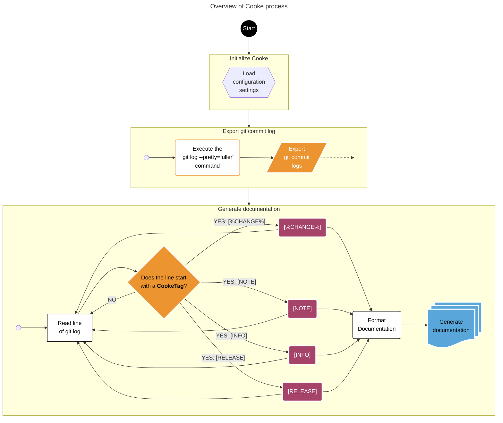

<!--
  260612_code
  260612_documentation
-->

  <picture>
    <source media="(prefers-color-scheme: dark)" srcset=".github/repository/logo/repository-logo-dark.png">
    <source media="(prefers-color-scheme: light)" srcset=".github/repository/logo/repository-logo-light.png">
    
  </picture>

  &nbsp;
  &nbsp; <!-- Alpha = Red, Beta = Yellow, Stable = Green -->
  &nbsp;
  &nbsp;

  <h3>CHANGELOG.md generator</h3>

---

<h6 align="center">

  [MANUAL](docs/man/README.md)&nbsp;&bull;&nbsp;[CHANGELOG](docs/CHANGELOG.md)&nbsp;&bull;&nbsp;[ROADMAP](docs/ROADMAP.md)&nbsp;&bull;&nbsp;[KNOWN ISSUES](docs/KNOWN-ISSUES.md)

</h6>

---

| CONTENTS                                    |
|---------------------------------------------|
| [About Cooke](#about-cooke) |
| [How It Works](#how-it-works)               |
| [Getting Started](#getting-started)         |
| [Installing](#installing)                   |
| [Usage](#usage)                             |
| [Acknowledgements](#acknowledgements)       |
| [Related Projects](#related-projects)       |
| [License](#license)                         |

## About Cooke

Cooke is a command-line tool that creates customized documentation for git repositories.
### Features

* Generates a CHANGELOG.md file
* Generates a RELEASE-NOTES.md file
* Highly customizable

### What's New

* New feature — A brief description of the new feature and its benefits.
* Improvement — A brief description of the improvement and its benefits.
* Bug fix — A brief description of the bug fix and its impact.

### Requirements

* .NET 8 runtime
* Windows operating system

> [!INFO] 
> Since Cooke is written in .NET 10 it should be (in theory) cross-platform, but currently has only been tested on Windows.

## How It Works

<!-- ========================================================= [HOW IT WORKS] -->

<!-- [GETTING STARTED] =========================================================
* Before you begin
  Any prerequisites, assumptions, or other information a user should know before
  getting started.
* Prerequisites
  List of software, hardware, or other requirements.

  If this section is only comprised of prerequisites, it can be merged with the
  About section.
============================================================================ -->

## Getting Started

A quick overview of how to get started with the project.

### Before you begin

Any assumptions, or other information a user should know before

### Requirements

| Requirement | Minimum version | Notes |
|-------------|-----------------|-------|
| [.NET SDK](https://dotnet.microsoft.com/en-us/download/dotnet/10.0) | 10.0 | Required to build and run. |
| Requirement | | |
| Requirement | | |

<!-- [INSTALLING] =========================================================
* Installing
  Step-by-step instructions for installing the project on supported platforms.

  This section may contain the Prerequisites.

  In general, this should be a quick overview of the installation process,
  with a link to docs/man/README.md.
============================================================================ -->

## Installing

Quick summary of installation instructions, or link to the Installing documentation.

<!-- ========================================================== [INSTALLING] -->

<!-- [USAGE] ===================================================================
* Usage
  Step-by-step instructions for using the project on supported platforms.
  Remove OS sections that are not supported.

  In general, this should be a quick overview of the usage process,
  with a link to docs/man/README.md.
============================================================================ -->

<!-- [SETUP] ===================================================================
* Setup
  Step-by-step instructions for setting up the project on supported platforms.
  Remove OS sections that are not supported.

  In general, this should be a quick overview of the setup process,
  with a link to docs/man/README.md.
============================================================================ -->

<!-- =============================================================== [SETUP] -->

## Usage

Step-by-step instructions for using the project on supported platforms.

<!-- =============================================================== [USAGE] -->

<!-- [DOCUMENTATION] ===========================================================
* Documentation
  A quick overview of the documentation.
============================================================================ -->

## Documentation

Documentation is available.

<!-- ======================================================= [DOCUMENTATION] -->

<!-- [ACKNOWLEDGEMENTS] ========================================================
* Acknowledgements
  List of acknowledgements, or remove this section if there are none.
============================================================================ -->

## Acknowledgements

None.

<!-- ==================================================== [ACKNOWLEDGEMENTS] -->

<!-- [RELATED PROJECTS] ========================================================
* Related projects
  List of related projects, or remove this section if there are none.
============================================================================ -->

## Related projects

None.

<!-- ==================================================== [RELATED PROJECTS] -->

<!-- [LICENSE] =================================================================
* License
  The license under which the project is distributed.
============================================================================ -->

## License

Distributed under the [Apache 2.0 License](LICENSE).  
Copyright &copy; 2026 %Owner%

<!-- ============================================================= [LICENSE] -->

---

<!-- [HORIZONTAL MENU] =========================================================
* Horizontal menu (bottom)
  Contains components that aren't in/don't belong in the table of contents.
---------------------------------------------------------------------------- -->

<h6 align="center">

  [FAQ](docs/FAQ.md)&nbsp;&bull;&nbsp;[DEVELOPMENT](docs/DEVELOPMENT.md)&nbsp;&bull;&nbsp;[API](docs/api/README.md)&nbsp;&bull;&nbsp;[TESTING](docs/TESTING.md)&nbsp;&bull;&nbsp;[SUPPORT](docs/SUPPORT.md)&nbsp;&bull;&nbsp;[NOTICES](docs/NOTICES.md)
  
</h6>

<!-- ===================================================== [HORIZONTAL MENU] -->

---

Last updated: 260612
